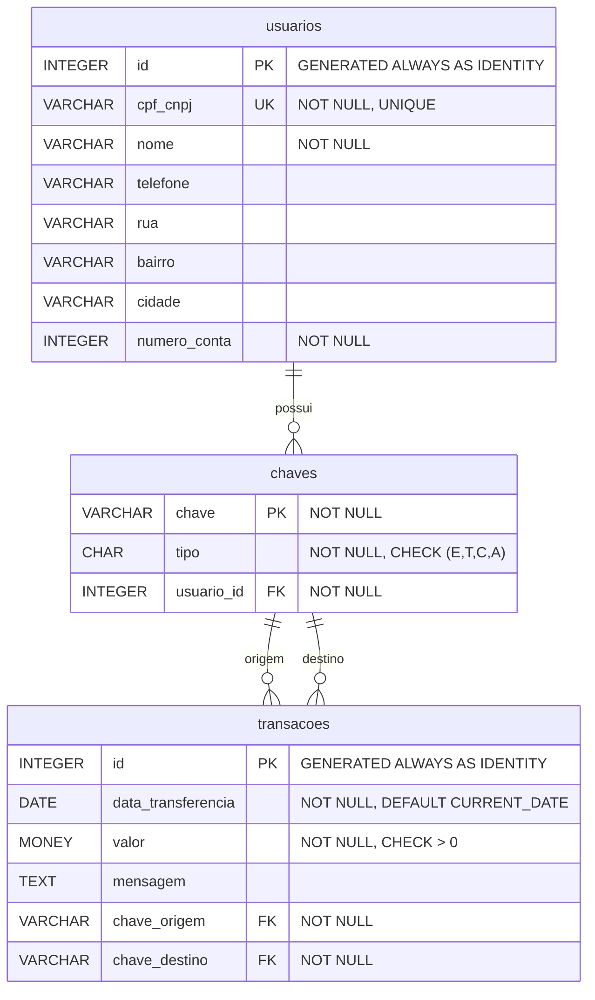

# top-ii-backend-api-template
Repositório da aplicação de backend simulando a API do PIX


## Diagrama Entidade-Relacionamento




### Descrição das Entidades

#### USUARIOS
- **Descrição**: Armazena informações dos usuários do sistema
- **Chave Primária**: id (auto-incremento)
- **Chave Única**: cpf_cnpj
- **Campos Obrigatórios**: id, cpf_cnpj, nome, numero_conta

#### CHAVES
- **Descrição**: Chaves PIX associadas aos usuários
- **Chave Primária**: chave (texto)
- **Tipos**: E (Email), T (Telefone), C (CPF/CNPJ), A (Aleatória)
- **Relacionamento**: Cada chave pertence a um usuário

#### TRANSACOES
- **Descrição**: Registra todas as transferências PIX realizadas
- **Chave Primária**: id (auto-incremento)
- **Relacionamentos**: Referencia duas chaves (origem e destino)
- **Restrições**: Valor deve ser positivo, chaves origem e destino devem ser diferentes

### Relacionamentos

1. **USUARIOS → CHAVES**: Um usuário pode ter múltiplas chaves PIX (1:N)
2. **CHAVES → TRANSACOES (origem)**: Uma chave pode ser origem de múltiplas transações (1:N)
3. **CHAVES → TRANSACOES (destino)**: Uma chave pode ser destino de múltiplas


## API REST - Endpoints

### Usuários

#### Listar usuários
```
GET /api/v1/usuarios
GET /api/v1/usuarios?page=1&limit=10
```

#### Buscar usuário por ID
```
GET /api/v1/usuarios/{id}
```

#### Buscar usuário por CPF/CNPJ
```
GET /api/v1/usuarios/cpf/{cpf_cnpj}
```

#### Criar usuário
```
POST /api/v1/usuarios
Content-Type: application/json

{
  "cpf_cnpj": "12345678901",
  "nome": "João Silva",
  "telefone": "11999999999",
  "rua": "Rua das Flores, 123",
  "bairro": "Centro",
  "cidade": "São Paulo",
  "numero_conta": 12345
}
```

#### Atualizar usuário
```
PUT /api/v1/usuarios/{id}
PATCH /api/v1/usuarios/{id}
```

#### Deletar usuário
```
DELETE /api/v1/usuarios/{id}
```

### Chaves PIX

#### Listar chaves de um usuário
```
GET /api/v1/usuarios/{usuario_id}/chaves
```

#### Buscar chave específica
```
GET /api/v1/chaves/{chave}
```

#### Criar chave PIX
```
POST /api/v1/usuarios/{usuario_id}/chaves
Content-Type: application/json

{
  "chave": "joao@email.com",
  "tipo": "E"
}
```

#### Deletar chave PIX
```
DELETE /api/v1/chaves/{chave}
```

#### Listar todas as chaves (admin)
```
GET /api/v1/chaves
```

### Transações

#### Listar transações
```
GET /api/v1/transacoes
GET /api/v1/transacoes?page=1&limit=20
GET /api/v1/transacoes?data_inicio=2024-01-01&data_fim=2024-12-31
```

#### Buscar transação por ID
```
GET /api/v1/transacoes/{id}
```

#### Histórico de transações por chave
```
GET /api/v1/chaves/{chave}/transacoes
GET /api/v1/chaves/{chave}/transacoes/enviadas
GET /api/v1/chaves/{chave}/transacoes/recebidas
```

#### Histórico de transações por usuário
```
GET /api/v1/usuarios/{usuario_id}/transacoes
```

#### Realizar transferência PIX
```
POST /api/v1/transacoes
Content-Type: application/json

{
  "chave_origem": "11999999999",
  "chave_destino": "maria@email.com",
  "valor": 100.50,
  "mensagem": "Pagamento aluguel"
}
```

#### Consultar saldo por chave
```
GET /api/v1/chaves/{chave}/saldo
```


### Códigos de Status HTTP

- `200 OK` - Sucesso
- `201 Created` - Recurso criado
- `204 No Content` - Sucesso sem retorno
- `400 Bad Request` - Dados inválidos
- `401 Unauthorized` - Não autorizado
- `403 Forbidden` - Acesso negado
- `404 Not Found` - Recurso não encontrado
- `409 Conflict` - Conflito (chave já existe)
- `422 Unprocessable Entity` - Validação falhou
- `500 Internal Server Error` - Erro interno

#### Filtros e Paginação

**Parâmetros comuns**:
- `page` - Número da página (padrão: 1)
- `limit` - Itens por página (padrão: 10, máximo: 100)
- `sort` - Campo para ordenação
- `order` - Direção da ordenação (asc/desc)

 **Exemplo**:
```
GET /api/v1/transacoes?page=2&limit=20&sort=valor&order=desc&data_inicio=2024-01-01
```